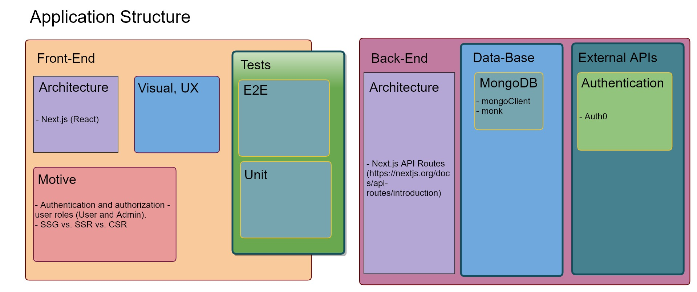

# 🔐 Next.js Auth0 MongoDB - User and admin roles 

User roles (No-login, User and Admin) implementation in a Next.js website, which also leverages MongoDB to store and display user data.

## Tech Stack
- [TypeScript](https://www.typescriptlang.org/)
- [Next.js](https://nextjs.org/)
- [Auth0](https://auth0.com/) - [auth0/nextjs-auth0](https://github.com/auth0/nextjs-auth0)
- [MongoDB](https://www.mongodb.com/)
- [Monk](https://automattic.github.io/monk/)



## Set Up

1. If you haven't already, clone the repo:
```bash
git clone https://github.com/wonderfloyd/Hackathon-Corona.git
```

2. Then `cd` into the project's folder and install the dependencies:
```bash
cd Hackathon-Corona/nextjs_mongodb_auth0_user_n_admin
npm install
```

### Auth0
3. Go to [Auth0's website]() and create an account (or login if you already have one).
4. In the Auth0 dashboard click the _Create Application_ button on the top right.
5. Name your application whatever you like, choose the _Regular Web Applications_ on the bottom, and click _Create_.
6. Copy the following values from your app's settings into `next.config.example.js` in the root of the project:
    - domain
    - clientId
    - clientSecret

    And then delete the `example` suffix from the file's name. __It should be ignored by `.gitignore`.__

7. Go to _Rules_ in the left menu, click the _Create Rule_ button, and select the _Empty Rule_ template.
8. The rule is meant to add user roles to the user profile. Name it whatever you like.
9. Copy the following into the editor and click _Save Changes_:
```js
function (user, context, callback) {
  const namespace = 'http://localhost:3000';
  const assignedRoles = (context.authorization || {}).roles;

  let idTokenClaims = context.idToken || {};
  let accessTokenClaims = context.accessToken || {};

  idTokenClaims[`${namespace}/roles`] = assignedRoles;
  accessTokenClaims[`${namespace}/roles`] = assignedRoles;

  context.idToken = idTokenClaims;
  context.accessToken = accessTokenClaims;

  callback(null, user, context);
}
```

10. To simulate a user using email and password, go to _Users & Roles_ => _Users_, and click the _Create User_ button.
11. To simulate a Google login using your Google account, click the _Google Login_ button in the login form.
12. To assign roles to users, first create the roles. Go to _Users & roles_ => _Roles_, click the _Create Role_ button, and add a role named `Admin`.
13. Repeat the last step, only this time name the role `User`.
14. To assign the roles to users, go to _Users & Roles_ => _Users_, click the three dots next to a user and click _Assign roles_.   

__Note: To test the app properly you'll need at least two users, where one of them is assigned an `Admin` role, and the other a `User` role.__ 


### MongoDB
15. Download the [Mongo client](https://docs.mongodb.com/manual/installation/) and install it.
16. To setup the MongoDB for this project open a command line and run the following:
```bash
mongo
use next-auth0-mongo 
db.createCollection('books') 
```
17. __To run the app you'll need to have a Mongo client running on port 27017 (which is the default).__

### __*That's it! you should be good to go.*__
To run a dev server:
```bash
npm run dev
```

To build and serve a production build:
```bash
npm run build
npm start
```