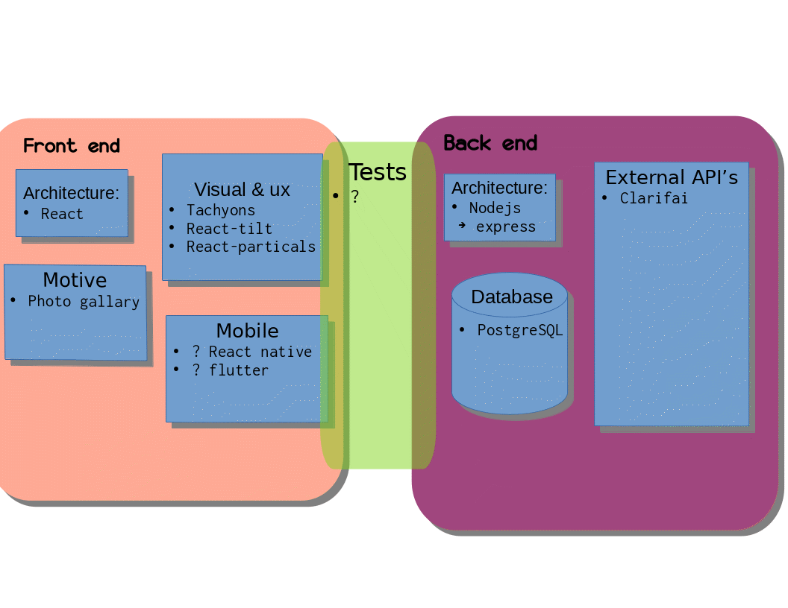

# 📷 React PostgreSQL Photo Album 
AI defined album using clarifai API

Based on [FILLME](https://www.fillme/) tutorial application
## FrontEnd
[React](https://www.fillme/)
## BackEnd
nodejs express application
## DataBase
[PostgresSQL](https://www.fillme/)
- ?? Which nodejs lib is used to work with postgres server ??
## Tests
??

TODO Cut space 

# Set Up
This Application is composed of 3 processes:
- Front-End Server
- myPhotos API Server
- Postgres SQL Server
## Setting Up Postgres Data-Base
### Install Postgres
[FILLME]()
### Start Postgres Server
    fillme
### Load db data
    fillme
- FILLME: give reference where db name is used in code
## Front-End Server
    cd myPhotos
    npm install
    npm start
Front-End Server should be up and serving http://localhost:3000
## myPhotos API Server
    cd myPhotos_api
    npm install
    npm start
Front-End Server should be up and serving http://localhost:3001
## Open Browser
http://localhost:3000
## Expected Page

