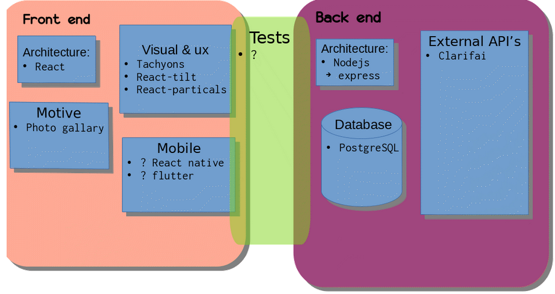
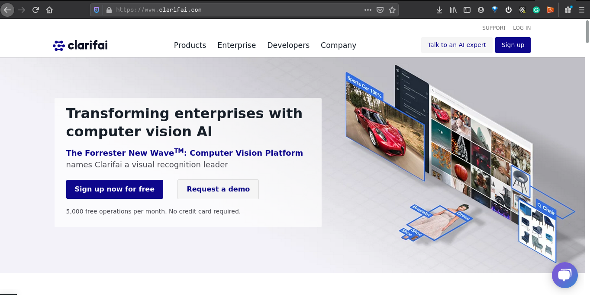
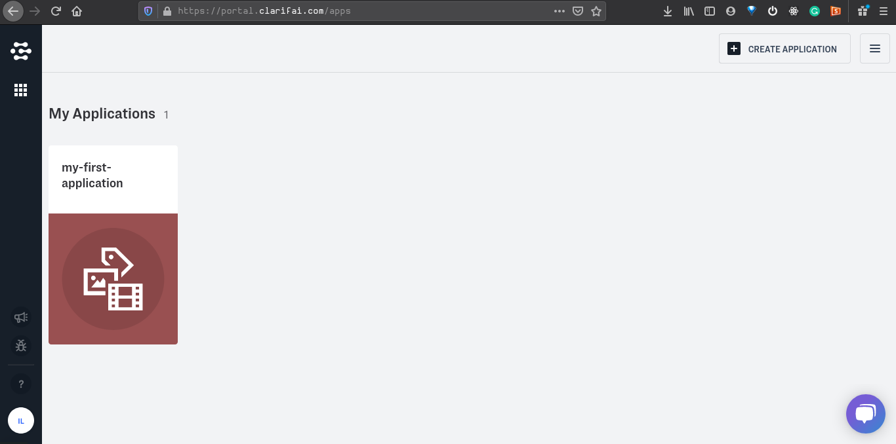
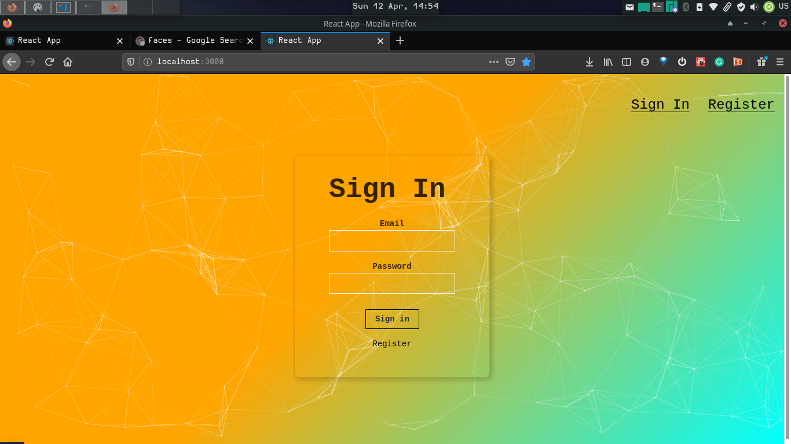

# 📷 React PostgreSQL Photo Album 
AI defined album using clarifai API

## FrontEnd
[React](https://reactjs.org/docs/getting-started.html)
## BackEnd
nodejs express application
## DataBase
[PostgresSQL](https://www.techonthenet.com/postgresql/)
we'll use **knexjs** library to talk with our database
checkout the documentation
   [Here](http://knexjs.org/#Installation)
## Tests



# Set Up
This Application is composed of 3 processes:
- Front-End Server
- myPhotos API Server
- Postgres SQL Server
## Setting Up Postgres Data-Base
### Download & Install Postgres
GUI installer [PostgreSQL](https://www.postgresql.org/download/)  
#### Or Just Use Cmd
#### For Mac
```
$ brew update
$ brew install postgresql
$ brew services start postgresql
```
#### For Linux
ubuntu:
```
$ sudo apt update && sudo apt install postgresql
$ systemctl start postgresql
```
arch:
```
$ sudo pacman -Syu
$ sudo pacman -S postgresql
$ systemctl start postgresql
```
*Note if you want to enable on startup run: $  systemctl enable postgresql*
#### For Windows
**very important windows users go throug this**
[PostgreSQL Tutorial](https://www.youtube.com/watch?v=BLH3s5eTL4Y)
### Create a DataBase
#### Mac & Linux users
- Launch a terminal/command-line & type
- `createdb 'database_name'` *(I'm going to call my new database "photo-app")*
- `$ createdb 'photo-app'`
### Configure db tables  
The back end [myPhotos_api](./myPhotos_api) needs 3 tables in the data base to work properly.
- launch the DB console in to your new database
- `$ psql 'database_name` *In my case It's*
- `$ psql 'photo-app'`
- Once your in the console you can start writing the SQL syntax query's like so:
```
    CREATE TABLE users (	
      id serial PRIMARY KEY,
      name VARCHAR(100),
      email text unique not null,
      entries BIGINT default 0,
      joined TIMESTAMP not null
     );
```  


*this will create the users table*
```
    CREATE TABLE login (	
      id serial PRIMARY KEY,
      hash VARCHAR(100) not null,
      email text unique not null
     );
```
*This will create the login table*  


```
    CREATE TABLE photos (	
      id serial PRIMARY KEY,
      user_id integer not null,
      classification VARCHAR(100),
      location VARCHAR(300) not null
     );
```
*This will create the photos table*  


SQL create table syntax 
```
  CREATE TABLE table_name (
      column_name column_type options,
      column_name  column_type options,
       ... 
  );  

``` 
[Data type reference](https://www.techonthenet.com/postgresql/datatypes.php)  

- If everything went will
 you can type the `\d` command to see your tables you should get an output like this
```
photo-app=# \d
            List of relations
 Schema |     Name     |   Type   | Owner 
--------+--------------+----------+-------
 public | login        | table    | itai
 public | login_id_seq | sequence | itai
 public | users        | table    | itai
 public | users_id_seq | sequence | itai
(4 rows)

```
# API 
## setting up your own AI api
- First you need to open an account [Here](https://www.clarifai.com/) in order to get your free api key  
*(login page)*  
  
- Sign up and enter your dashboard

- Click on "My Application" *(If it's not their create one)*
- Get your api key
## Set up a .env file in the root of [myPhotos_api](myPhotos_api/.env)
e.g:  
```

CLARIFAI_API_KEY='your_privet_api_key'
PORT=3001
HOST='127.0.0.1'
USER='your_db_username'
DB_NAME='your_db_name'

```

## Front-End Server
    cd myPhotos
    npm install
    npm start
Front-End Server should be up and serving http://localhost:3000
## myPhotos API Server
    cd myPhotos_api
    npm install
    npm start
Front-End Server should be up and serving http://localhost:3001
## Open Browser
http://localhost:3000
## Expected Page

